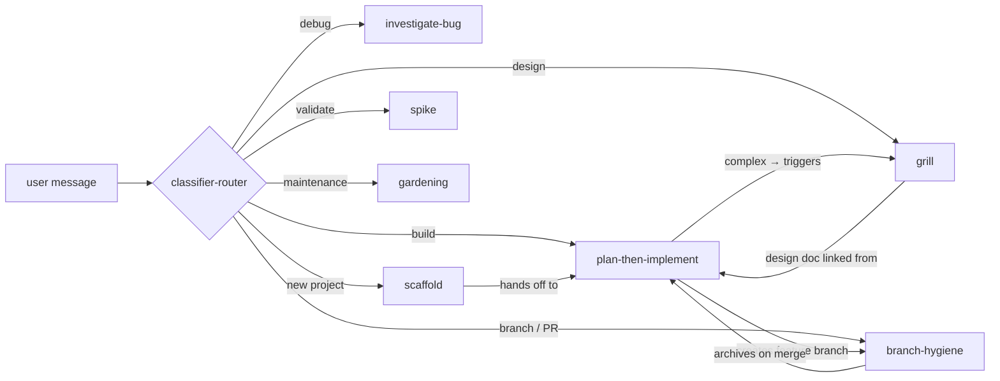

# Pi Agent Harness

> A solo-developer agent harness: composable skills, persistent project memory, event-driven extensions, and a config-driven memory-lifecycle system that keeps your agent's context healthy over time.

---

## Quick Start

```bash
# 1. Clone — the repo root is ~/.pi, so agent/ lands at ~/.pi/agent/
git clone https://github.com/LabidySabidy/pi-agent-harness.git ~/.pi

# 2. Seed your personal files (templates → live)
cp ~/.pi/agent/LESSONS.md.template ~/.pi/agent/LESSONS.md
cp ~/.pi/agent/AGENTS.md.template ~/.pi/agent/AGENTS.md
# Edit AGENTS.md: replace the Context section with your role, stack, platform.

# 3. Start Pi in any project directory
cd ~/my-project
pi
```

Pi auto-loads skills from `~/.pi/agent/skills/` and extensions from `~/.pi/agent/extensions/` on startup. No config files, no install scripts.

---

## How it works

Three layers. Skills compose via one-line invocations — they don't merge text.



| Layer | Location | What it does |
|---|---|---|
| **Skills** | `~/.pi/agent/skills/` | Reusable workflows invoked via `/skill:name` or auto-routed by the classifier |
| **Extensions** | `~/.pi/agent/extensions/` | TypeScript hooks on agent lifecycle events — classify intents, update PROGRESS.md, extract lessons, collect telemetry |
| **Memory** | `<project>/` + `~/.pi/agent/` | Markdown files that persist across sessions — VISION.md, LESSONS.md, PROGRESS.md, PLAN.md |

### Session lifecycle

1. **Start** — Reads global files (STANDARDS.md, LESSONS.md), then project files (VISION.md, PROGRESS.md, LESSONS.md). Runs `git log -20`. Checks branch tracking.
2. **Routing** — `classifier-router` classifies every user message and routes to the right skill.
3. **Execution** — Skills run. `session-summary` updates PROGRESS.md after each turn. `extract-patterns` scans for lesson candidates. `telemetry` tracks tokens, citations, skills, and gates.
4. **End** — Rolling PROGRESS.md entry finalized. Extract-patterns does a final sweep. Branch-hygiene archives PLAN.md and TASKS.md on merge.

### Design principles

- **Skills over monolith** — Each skill owns one workflow. Compose via one-line invocations, not merged text.
- **Memory over amnesia** — VISION.md, LESSONS.md, and PROGRESS.md accumulate across sessions.
- **Triage over uniform process** — Throwaway tool vs real product. Trivial change vs grill-worthy. The process scales to the stakes.
- **Verification over assertion** — Never claim "done" without fresh test output, build log, or curl response in the message.

---

## Skills

All skills live at `~/.pi/agent/skills/`. Invoke explicitly (`/skill:name`) or let the classifier-router pick.

| Skill | Triggers | What it does |
|---|---|---|
| [scaffold](agent/skills/skill-scaffold.md) | `scaffold`, `bootstrap`, `new project` | Triage → discovery → VISION.md, PLAN.md, TASKS.md, PROGRESS.md |
| [spike](agent/skills/skill-spike.md) | `spike`, `prototype`, `can this even work` | 15-minute throwaway script for one risky assumption |
| [grill](agent/skills/skill-grill.md) | `grill me`, `poke holes`, `red team` | 8-dimension adversarial design review → `.agent/grill/` |
| [plan-then-implement](agent/skills/skill-plan-then-implement.md) | `build this`, `implement this` | Read → PLAN.md → TASKS.md → TDD per phase → gates |
| [investigate-bug](agent/skills/skill-investigate-bug.md) | `investigate`, `debug`, `why is this failing` | 8-step defect investigation → root cause → fix plan |
| [branch-hygiene](agent/skills/skill-branch-hygiene.md) | `branch`, `create PR`, `ship it` | Phase A: create `feat/*` branch. Phase B: push PR / merge / discard. Cleanup stale branches. |
| [gardening](agent/skills/skill-gardening.md) | `garden`, `gardening`, `clean up lessons`, `prune`, `promote lessons` | Config-driven memory maintenance: 8 passes for intake, merge, demote, compress, progress-horizon, asset sweeps, break-in review, and reporting. Replaces promote-lessons. |

### Legacy skills

**promote-lessons** — superseded by gardening. The classifier still routes `promote lessons` to gardening. The old skill file is kept as a redirect stub. Use `/skill:gardening --pass intake` for lesson review, or run the full gardening session for a complete memory checkup.

### When to use which

```
New project?                    → /skill:scaffold
Uncertain if something works?   → /skill:spike
Building a feature?             → /skill:plan-then-implement
Design feels shaky?             → /skill:grill
Something's broken?             → /skill:investigate-bug
Ready to merge?                 → /skill:branch
Memory getting cluttered?       → /skill:gardening
```

---

## Memory lifecycle

The harness maintains project memory files across sessions. Over time these files grow — more lessons, more progress entries, more design artifacts. The memory-lifecycle system (gardening + telemetry) keeps this sustainable.

### Lesson identity and stats

Every lesson gets a unique ID (`GL-NNN` for global, `L-NNN` for project). The `telemetry` extension tracks every citation — when the agent references a lesson in a response, it registers a hit in `lesson-stats.json`. This powers:

- **Decay tracking** — uncited lessons decay (0.9× per session); cited lessons reset to 1.0
- **Demotion eligibility** — when decay drops below a configurable threshold and the grace period has passed, gardening can propose removal
- **Anchor lessons** — damage-preventing lessons flagged as anchors get extra scrutiny before modification
- **Merge detection** — near-duplicate lessons with different IDs can be consolidated

### PROGRESS.md windowing

PROGRESS.md accumulates entries indefinitely, but the boot protocol only reads the newest `N` entries (configured in `garden.json → progressWindow.loadEntries`). The rest stays on disk for lazy lookup — same principle as `references/`. This keeps boot cost constant regardless of PROGRESS.md size.

### Gardening passes

`/skill:gardening` runs up to 8 configurable passes: intake (review lesson candidates), merge, demote, compress, progress horizon (archive old entries), asset sweeps, break-in review, and summary reporting. Each pass is independently gated or auto-run per `garden.json → autonomy`. The deny-list protects core harness files — gardening can't touch skills, extensions, config, or the garden.json that defines its own limits.

### What's on by default

- `telemetry` extension: on. Tracks citations, tokens, skills, gates. Writes to `.agent/telemetry.jsonl`.
- `extract-patterns` extension: on. Scans for lesson candidates. Writes to `.agent/lessons-pending.md`.
- `session-summary` extension: on. Rolling PROGRESS.md entries.
- `classifier-router` extension: on. Auto-routes messages to skills via DeepSeek.
- `gardening-command` extension: on. Provides the `/gardening` command as an alternate entrance to `/skill:gardening`.

---

## Boot payload

Every session starts by loading protocol files into context. This table reflects what's actually read:

| File | chars | tokens |
|---|---|---|
| AGENTS.md (global) | ~7,928 | ~1,982 |
| STANDARDS.md (global) | ~3,717 | ~929 |
| LESSONS.md (global) | ~3,112 | ~778 |
| PROGRESS.md (windowed: first 50 lines / ~5 entries) | varies | ~400 |
| git log -20 | ~800 | ~200 |
| **Total** | **~15,557** | **~4,289** |

Plus project-level files when present (project AGENTS.md, STANDARDS.md, VISION.md, PROGRESS.md, LESSONS.md). Project PROGRESS.md is also windowed to 5 entries.

PROGRESS windowing is the durable win: 108 entries on disk, 5 loaded at boot — constant cost regardless of file growth. The AGENTS.md diet from an earlier pass was marginal (the file-layout reference was relocated to `references/authoring.md`; all operating rules remain in AGENTS.md). No further obvious candidates for relocation — the remaining content is all session-start protocol and operating principles.

---

## Acceptance gates

Per-stack verification commands run in order (lint → type → test → build → security). Stop at first failure. Project STANDARDS.md overrides defaults.

| Stack | Gates |
|---|---|
| Java / Spring Boot | `mvn checkstyle:check` → `mvn test` → `mvn package` |
| TypeScript (React/Angular) | `npm run lint` → `tsc --noEmit` → `npm test` → `npm run build` → `npm audit` |
| Python / Flask | `ruff check .` → `mypy src/` → `pytest -v` → `pip-audit` |

**Verification-before-claim rule:** Never claim "done," "fixed," or "passing" without fresh test/build/curl output in the current message. Past output is stale.

---

## Extensions

Four TypeScript modules in `~/.pi/agent/extensions/` hook into Pi's event system:

| Extension | Hooks | What it does |
|---|---|---|
| **classifier-router** | `input` | Classifies user messages via DeepSeek → routes to the right skill |
| **session-summary** | `agent_end`, `session_start`, `session_shutdown` | Maintains a rolling PROGRESS.md entry; auto-finalizes on shutdown |
| **extract-patterns** | `agent_end`, `session_shutdown` | Scans new assistant messages for lesson candidates; incremental via `.agent/.extract-state.json` |
| **telemetry** | `session_start`, `turn_end`, `agent_end`, `session_shutdown` | Session-level telemetry: boot payload, token usage, lesson citations, skill invocations, gate results. Append-only JSONL with journal recovery. |

---

## Prerequisites

- **Pi** 0.80+ (the coding agent itself)
- **Node.js** 18+ (for extensions)
- **OpenRouter API key** — set `OPENROUTER_API_KEY` in your environment. The classifier-router uses this for intent routing. Without it, automatic routing is disabled but manual `/skill:name` invocation still works — every skill loads from disk without an API call.

---

## Configuration

User-customizable files (all optional — the harness works with defaults):

| File | Location | Purpose |
|---|---|---|
| `AGENTS.md` | `~/.pi/agent/AGENTS.md` | Your personal context: role, stack, platform, operating principles |
| `garden.json` | `~/.pi/agent/garden.json` | Gardening budgets, autonomy levels, decay parameters, sweat horizons |
| `STANDARDS.md` | `~/.pi/agent/STANDARDS.md` | Capability mappings, acceptance gates per stack |
| `LESSONS.md.template` | `~/.pi/agent/` | Seed your global lessons file (copy to `LESSONS.md` via Quick Start step 2) |
| Templates | `~/.pi/agent/templates/` | Project scaffold templates: VISION.md, PLAN.md, TASKS.md, PROGRESS.md, LESSONS.md |

---

## File layout

```
~/.pi/agent/                         # Global harness
├── AGENTS.md                        # Preamble, rules, memory protocol
├── STANDARDS.md                     # Gates, capability mapping
├── LESSONS.md                       # Cross-project patterns
├── garden.json                      # Memory-lifecycle config (budgets, decay, autonomy)
├── lesson-stats.json                # Lesson citation stats (telemetry-maintained)
├── skills/                          # Composable skills
│   ├── skill-scaffold.md
│   ├── skill-spike.md
│   ├── skill-grill.md
│   ├── skill-plan-then-implement.md
│   ├── skill-investigate-bug.md
│   ├── skill-branch-hygiene.md
│   └── skill-gardening.md
├── extensions/                      # Event-driven TypeScript
│   ├── classifier-router/
│   ├── session-summary/
│   ├── extract-patterns/
│   ├── telemetry/
│   └── gardening-command/
└── templates/                       # File templates for scaffold
    ├── VISION.md
    ├── PLAN.md
    ├── TASKS.md
    ├── PROGRESS.md
    └── LESSONS.md                   # Project-scaffold LESSONS template (not the seed)

<project>/                           # Per-project memory
├── VISION.md                        # App identity + glossary + architecture
├── PLAN.md                          # Current implementation plan
├── TASKS.md                         # Task list
├── LESSONS.md                       # Project-specific patterns
├── PROGRESS.md                      # Session summaries
└── .agent/                          # System data
    ├── lessons-pending.md
    ├── .extract-state.json
    ├── telemetry.jsonl
    ├── lesson-stats.json
    ├── grill/                       # Design interrogation
    ├── archive/                     # Historical plans/tasks
    └── reports/                     # Gardening reports (durable, never swept)
```
