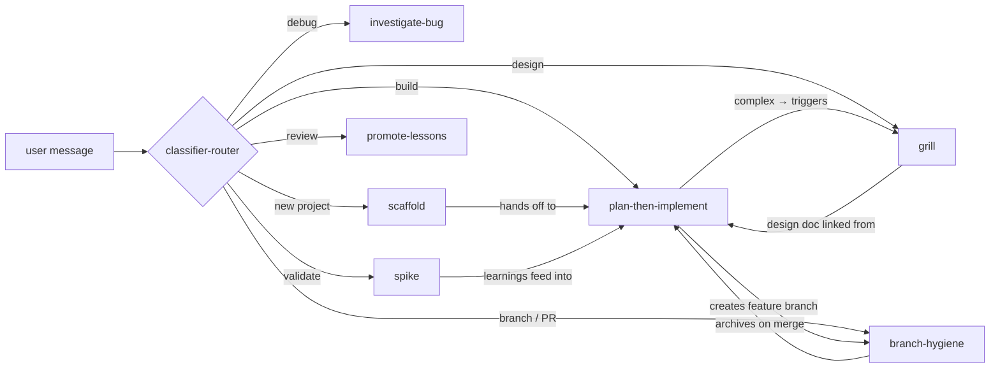

# Pi Agent Harness

> A solo-developer agent harness: composable skills, persistent project memory, and event-driven extensions for the Pi coding agent.

---

## Quick Start

```bash
# 1. Clone into Pi's home directory (so agent/ lands at ~/.pi/agent/)
git clone https://github.com/LabidySabidy/pi-agent-harness.git ~/.pi

# 2. Customize your context: edit ~/.pi/agent/AGENTS.md (Context section)

# 2. Start Pi in any project directory — skills and extensions auto-discover

# 3. Scaffold a new project
/skill:scaffold

# 4. Or jump into an existing one
/skill:plan-then-implement
```

Pi auto-loads skills from `~/.pi/agent/skills/` and extensions from `~/.pi/agent/extensions/` on startup. No config files, no install scripts.

---

## How it works

Three layers. Skills compose via one-line invocations — they don't merge text.



| Layer | Location | What it does |
|---|---|---|
| **Skills** | `~/.pi/agent/skills/` | Reusable workflows invoked via `/skill:name` or auto-routed by the classifier |
| **Extensions** | `~/.pi/agent/extensions/` | TypeScript hooks on agent lifecycle events — classify intents, update PROGRESS.md, extract lessons |
| **Memory** | `<project>/` + `~/.pi/agent/` | Markdown files that persist across sessions — VISION.md, LESSONS.md, PROGRESS.md, PLAN.md |

### Session lifecycle

1. **Start** — Reads global files (STANDARDS.md, LESSONS.md), then project files (VISION.md, PROGRESS.md, LESSONS.md). Runs `git log -20`. Checks branch tracking.
2. **Routing** — `classifier-router` classifies every user message and routes to the right skill.
3. **Execution** — Skills run. `session-summary` updates PROGRESS.md after each turn. `extract-patterns` scans for lesson candidates.
4. **End** — Rolling PROGRESS.md entry finalized. Extract-patterns does a final sweep. Branch-hygiene archives PLAN.md and TASKS.md on merge.

### Design principles

- **Skills over monolith** — Each skill owns one workflow. Compose via one-line invocations, not merged text.
- **Memory over amnesia** — VISION.md, LESSONS.md, and PROGRESS.md accumulate across sessions.
- **Triage over uniform process** — Throwaway tool vs real product. Trivial change vs grill-worthy. The process scales to the stakes.
- **Verification over assertion** — Never claim "done" without fresh test output, build log, or curl response in the message.

---

## Skills

All skills live at `~/.pi/agent/skills/`. Invoke explicitly (`/skill:name`) or let the classifier-router pick.

| Skill | Triggers | What it does |
|---|---|---|
| [scaffold](agent/skills/skill-scaffold.md) | `scaffold`, `bootstrap`, `new project` | Triage → discovery → VISION.md, PLAN.md, TASKS.md, PROGRESS.md |
| [spike](agent/skills/skill-spike.md) | `spike`, `prototype`, `can this even work` | 15-minute throwaway script for one risky assumption |
| [grill](agent/skills/skill-grill.md) | `grill me`, `poke holes`, `red team` | 8-dimension adversarial design review → `.agent/grill/` |
| [plan-then-implement](agent/skills/skill-plan-then-implement.md) | `build this`, `implement this` | Read → PLAN.md → TASKS.md → TDD per phase → gates |
| [investigate-bug](agent/skills/skill-investigate-bug.md) | `investigate`, `debug`, `why is this failing` | 8-step defect investigation → root cause → fix plan |
| [branch-hygiene](agent/skills/skill-branch-hygiene.md) | `branch`, `create PR`, `ship it` | Phase A: create `feat/*` branch. Phase B: push PR / merge / discard. Cleanup stale branches. |
| [promote-lessons](agent/skills/skill-promote-lessons.md) | `promote lessons`, `review pending` | One-at-a-time review of `.agent/lessons-pending.md` → LESSONS.md |

### When to use which

```
New project?                    → /skill:scaffold
Uncertain if something works?   → /skill:spike
Building a feature?             → /skill:plan-then-implement
Design feels shaky?             → /skill:grill
Something's broken?             → /skill:investigate-bug
Ready to merge?                 → /skill:branch
Pending lessons piling up?      → /skill:promote-lessons
```

---

## Memory

Project files persist across sessions. The agent reads them at startup, writes during and after each session.

### What writes what, and when

| When | Writer | Output |
|---|---|---|
| Every turn | `extract-patterns` | `.agent/lessons-pending.md` |
| Every turn | `session-summary` | `PROGRESS.md` (rolling entry) |
| Manual | `grill` | `.agent/grill/<topic>.md` |
| Manual | `plan-then-implement` | `PLAN.md`, `TASKS.md` |
| Manual | `promote-lessons` | `LESSONS.md` |
| Merge | `branch-hygiene` | `.agent/archive/` (copies of PLAN.md + TASKS.md) |
| Shutdown | `session-summary` | `PROGRESS.md` (finalized) |
| Shutdown | `extract-patterns` | `.agent/lessons-pending.md` (final sweep) |

| File | Location | Purpose |
|---|---|---|
| VISION.md | Project | App identity, users, architecture, domain glossary |
| PLAN.md | Project | Current implementation plan (one feature at a time) |
| TASKS.md | Project | Task list with `Done when:` criteria per task |
| LESSONS.md | Project | Danger zones, gotchas, decisions, anti-patterns |
| PROGRESS.md | Project | Rolling session summaries (newest first) |
| `.agent/lessons-pending.md` | Project | Auto-extracted lesson candidates (review with `/skill:promote-lessons`) |
| `.agent/grill/` | Project | Design interrogation outputs |
| `.agent/archive/` | Project | Historical PLAN.md + TASKS.md snapshots |
| `~/.pi/agent/LESSONS.md` | Global | Patterns that apply across projects |

### How lessons flow

1. **`extract-patterns`** scans assistant messages on every `agent_end` for patterns (danger zones, gotchas, decisions, anti-patterns, always-do).
2. Candidates land in `.agent/lessons-pending.md` — silent, no notification.
3. **`/skill:promote-lessons`** reviews them one at a time. Accept → project LESSONS.md. Promote-global → `~/.pi/agent/LESSONS.md`. Skip → removed.
4. Both LESSONS.md files are loaded at session start so past mistakes aren't repeated.

---

## Acceptance gates

Per-stack verification commands run in order (lint → type → test → build → security). Stop at first failure. Project STANDARDS.md overrides defaults.

| Stack | Gates |
|---|---|
| Java / Spring Boot | `mvn checkstyle:check` → `mvn test` → `mvn package` |
| TypeScript (React/Angular) | `npm run lint` → `tsc --noEmit` → `npm test` → `npm run build` → `npm audit` |
| Python / Flask | `ruff check .` → `mypy src/` → `pytest -v` → `pip-audit` |

**Verification-before-claim rule:** Never claim "done," "fixed," or "passing" without fresh test/build/curl output in the current message. Past output is stale.

---

## Extensions

Three TypeScript modules in `~/.pi/agent/extensions/` hook into Pi's event system:

| Extension | Hooks | What it does |
|---|---|---|
| **classifier-router** | `input` | Classifies user messages via DeepSeek → routes to the right skill |
| **session-summary** | `agent_end`, `session_start`, `session_shutdown` | Maintains a rolling PROGRESS.md entry; auto-finalizes on shutdown |
| **extract-patterns** | `agent_end`, `session_shutdown` | Scans new assistant messages for lesson candidates; incremental via `.agent/.extract-state.json` |

---

## File layout

```
~/.pi/agent/                         # Global harness
├── AGENTS.md                        # Preamble, rules, memory protocol
├── STANDARDS.md                     # Gates, capability mapping
├── LESSONS.md                       # Cross-project patterns
├── README.md                        # This file
├── skills/                          # Composable skills
│   ├── skill-scaffold.md
│   ├── skill-spike.md
│   ├── skill-grill.md
│   ├── skill-plan-then-implement.md
│   ├── skill-investigate-bug.md
│   ├── skill-branch-hygiene.md
│   └── skill-promote-lessons.md
├── extensions/                      # Event-driven TypeScript
│   ├── classifier-router/
│   ├── session-summary/
│   └── extract-patterns/
└── templates/                       # File templates for scaffold
    ├── VISION.md, PLAN.md, TASKS.md, PROGRESS.md
    └── LESSONS.md

<project>/                           # Per-project memory
├── VISION.md                        # App identity + glossary + architecture
├── PLAN.md                          # Current implementation plan
├── TASKS.md                         # Task list
├── LESSONS.md                       # Project-specific patterns
├── PROGRESS.md                      # Session summaries
└── .agent/                          # System data
    ├── lessons-pending.md
    ├── .extract-state.json
    ├── grill/                       # Design interrogation
    └── archive/                     # Historical plans/tasks
```
