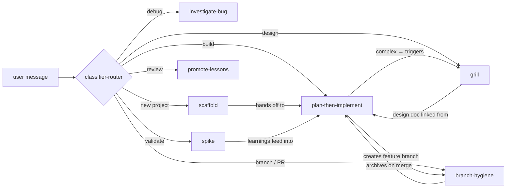
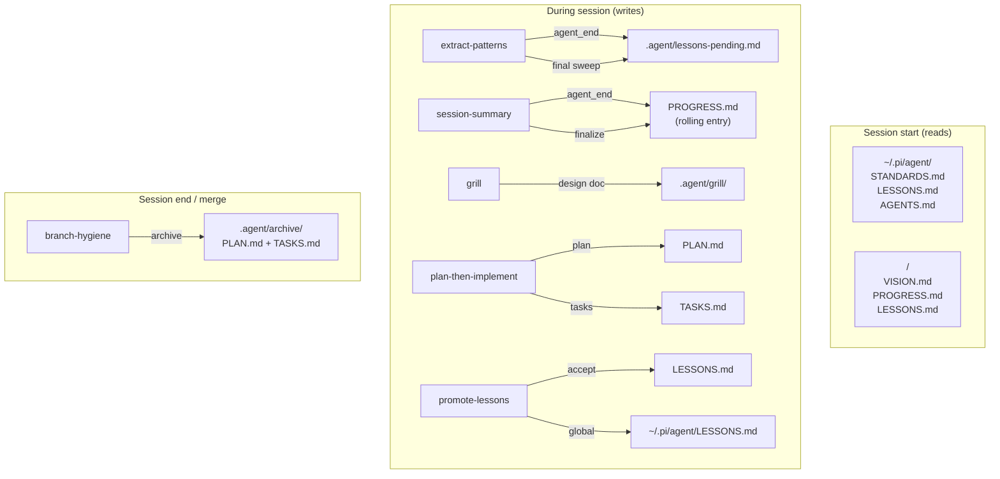

# Pi Agent Harness

> A solo-developer agent harness built on composable skills, project-scoped persistent memory, and event-driven extensions.

## Architecture



**How skills compose.** The classifier-router inspects every message and routes to exactly one skill. Skills invoke each other at integration points — plan-then-implement triggers grill for complex plans, delegates branch creation to branch-hygiene, and references grill design docs. Spike feeds feasibility learnings into the upcoming plan.



**What writes where, and when.** Extensions and skills produce artifacts in three phases. Session start reads global + project memory. During the session, extensions fire on every turn (`agent_end`) and skills write on explicit invocation. Session end finalizes rolling entries and archives completed work.

## How it works

The harness has three layers:

| Layer | Location | Purpose |
|---|---|---|
| **Global** | `~/.pi/agent/` | AGENTS.md (preamble + behavioral rules), STANDARDS.md (acceptance gates + model mapping), LESSONS.md (cross-project patterns), skills, extensions |
| **Project** | `<project>/` | VISION.md, PLAN.md, TASKS.md, LESSONS.md, PROGRESS.md — persistent memory files that accumulate understanding across sessions |
| **Extensions** | `~/.pi/agent/extensions/` | TypeScript event hooks that fire on agent lifecycle events — classify intents, auto-update PROGRESS.md, auto-extract lessons |

### Session lifecycle

1. **Start** — AGENTS.md session-start protocol reads global files (STANDARDS.md, LESSONS.md), then project files (VISION.md, PROGRESS.md, LESSONS.md). `git log --oneline -20` loads recent context. Branch tracking check runs.
2. **Routing** — The `classifier-router` extension classifies user messages via DeepSeek and routes to the appropriate skill (grill, plan-then-implement, investigate-bug, etc.).
3. **Execution** — Skills run as composable workflows. They invoke each other at integration points (e.g., plan-then-implement → grill → branch).
4. **Turn end** — `session-summary` updates a rolling entry in PROGRESS.md after every `agent_end`. `extract-patterns` scans new assistant messages for lesson candidates.
5. **Shutdown** — `session-summary` finalizes the rolling PROGRESS.md entry. `extract-patterns` does a final sweep. Any pending lessons are queued in `.agent/lessons-pending.md`.

### Key design principles

- **Skills over monolith** — Each skill owns exactly one workflow. Skills reference each other at explicit integration points (one-line invocations), never by merging text.
- **Memory over amnesia** — VISION.md, LESSONS.md, PROGRESS.md persist across sessions. The agent doesn't start from zero.
- **Surgical over sweeping** — The "Surgical Changes" principle: touch only what's needed. Skills are narrow, edits are precise.
- **Triage over uniform process** — Scaffold asks "throwaway or real?" before choosing the process path. Grill only fires on non-trivial work. TDD only fires on logic changes.
- **Verification over assertion** — The verification-before-claim rule: no "done," "fixed," or "passing" without fresh evidence in the message.

## Setup

### Prerequisites

- **Pi** (coding agent) installed and running in VS Code terminal
- **Node.js** (for extensions — TypeScript compiled by Pi automatically)
- **Git** (for branch hygiene and session context)
- **gh CLI** (optional — for automatic PR creation)

### Installation

The harness lives at `~/.pi/agent/`. Clone or symlink:

```bash
# Option A: clone into the default location
git clone <your-repo> ~/.pi/agent/

# Option B: symlink from your development directory
ln -s /path/to/your/agent-config ~/.pi/agent
```

Pi auto-discovers skills from `~/.pi/agent/skills/` and extensions from `~/.pi/agent/extensions/` on startup.

### Per-project setup

Projects don't need any harness files to work — the global AGENTS.md applies by default. Add project files only when you need overrides:

```bash
# Minimal: scaffold a new project
/skill:scaffold

# Add branch tracking (creates feat/* branches before work)
# Add to project AGENTS.md frontmatter:
# ---
# branch_tracking: true
# ---

# Override acceptance gates (e.g., different test framework)
# Create <project>/STANDARDS.md
```

---

## Skills catalog

Skills are invoked explicitly (`/skill:name`) or auto-routed by the classifier. Each skill has a frontmatter block with `triggers` — phrases that the classifier matches against.

### Skill composition

Skills don't merge — they compose at integration points. Example: `plan-then-implement` Step 3 says:

> If branch tracking is enabled, invoke `/skill:branch` (Phase A) to create a feature branch.

That's one line. Not five paragraphs absorbed into plan-then-implement.

### Skill list

| Skill | Triggers | What it does |
|---|---|---|
| **scaffold** | `scaffold`, `bootstrap`, `new project` | Triage (throwaway vs product) → discovery flow → VISION.md, PLAN.md, TASKS.md, PROGRESS.md |
| **spike** | `spike`, `prototype`, `can this even work` | 15-minute throwaway script validating one risky assumption → PROCEED/PIVOT/KILL |
| **grill** | `grill me`, `poke holes`, `red team` | Adversarial design interrogation across 8 dimensions → `.agent/grill/<topic>.md` |
| **plan-then-implement** | `build this`, `implement this`, `plan and implement` | Read codebase → PLAN.md → TASKS.md → execute phases with TDD → gates → PROGRESS.md |
| **investigate-bug** | `investigate`, `debug`, `why is this failing` | 8-step defect investigation: gather → confirm → scope → investigate → root cause → fix plan → implement |
| **branch-hygiene** | `branch`, `wrap up`, `create PR`, `ship it`, `clean up branches` | Phase A: create `feat/*` or `fix/*` branch. Phase B: push PR or merge locally. Cleanup: delete stale merged branches |
| **promote-lessons** | `promote lessons`, `review pending lessons` | One-at-a-time review of `.agent/lessons-pending.md` candidates → accept/skip/edit/promote-global |

### Skill deep dives

#### grill — Adversarial Design Interrogation

Walks 8 dimensions before any code is written: goal clarity, assumptions, failure modes, scope, integration points, performance, testing, risk ranking. Outputs a structured design concept to `.agent/grill/<topic>.md` that plan-then-implement references in its **References** section.

Hard rule: never write code while grilling. Ends with "ready to implement?"

#### plan-then-implement — Feature Workflow

The backbone skill. 6 steps:
1. **Read** — walk relevant files + tests + VISION.md + LESSONS.md + git log
2. **Plan** — write PLAN.md using the template. Check grill triggers (4+ files, new dependency, auth/payments, open questions → auto-invoke grill)
3. **Branch** — if `branch_tracking: true`, invoke `/skill:branch` Phase A
4. **Execute** — TDD per phase (RED → GREEN → REFACTOR → gates)
5. **Verify** — full STANDARDS.md gate suite + acceptance criteria checkboxes
6. **Record** — update PROGRESS.md via session-summary

#### investigate-bug — Defect Investigation

8 steps: gather details → summarize and confirm → identify scope → investigate code → root cause (with evidence) → TDD fix plan → save fix plan → implement. Hard rule: never code before the user approves the root cause.

#### scaffold — New Project Bootstrap

Triage first: "throwaway or real?" Throwaway path skips VISION.md, produces only PLAN.md + TASKS.md. Real-product path runs 5-question discovery (customer, problem, solution shape, core functionality, constraints) and produces VISION.md (with domain glossary + architecture), PLAN.md, TASKS.md, PROGRESS.md.

#### spike — Feasibility Validation

One question per spike. Throwaway code (no error handling, no tests, no structure). 15-minute cap. Run it or it didn't happen. Ends with PROCEED / PIVOT / KILL. Learnings feed into the upcoming PLAN.md.

#### branch-hygiene — Git Traceability

Per-project opt-in via `branch_tracking: true` in project AGENTS.md. Phase A: creates `feat/<name>` or `fix/<name>` from base branch. Phase B: 3 options (push PR, merge locally, discard). Cleanup mode: finds and deletes stale merged branches. Archives PLAN.md and TASKS.md on merge.

#### promote-lessons — Pending Review

Interactive one-at-a-time review of `.agent/lessons-pending.md` candidates. Each candidate shows category + text + context excerpt. Accept (→ project LESSONS.md), skip, edit, skip-all-in-category, promote-global (→ `~/.pi/agent/LESSONS.md`), or quit. Writes incrementally — no data loss on crash.

---

## Memory system

The harness maintains persistent memory across sessions through a set of project-scoped markdown files. The agent reads them at session start and writes to them during and at the end of each session.

### Files loaded at session start

| File | Location | Content | Absent? |
|---|---|---|---|
| STANDARDS.md | Global | Acceptance gates + model capability mapping | Never (always present) |
| LESSONS.md | Global | Cross-project gotchas, anti-patterns, always-do | Skip (only populated over time) |
| AGENTS.md | Nearest walking up | Project preamble overrides | Falls back to global |
| STANDARDS.md | Project | Project gate overrides | Skip (most projects don't have one) |
| VISION.md | Project | App identity, users, scope, architecture, domain glossary | Required for real products |
| PROGRESS.md | Project | Rolling session summaries (last 50 lines) | Skip (created on first session) |
| LESSONS.md | Project | Danger zones, gotchas, decisions, anti-patterns | Skip (populated by promote-lessons) |

### Auto-extraction (extract-patterns)

Fires on `agent_end` (every turn) and `session_shutdown` (safety net). Scans only new assistant messages since the last processed entry. Strips code fences and tool content. Matches marker phrases against 5 categories:

| Category | Marker keywords |
|---|---|
| Danger zones | danger, watch out, careful, risky, never, fragile, breaks if, fails when |
| Gotchas | gotcha, caveat, note that, be aware, easy to miss, surprising, counterintuitive |
| Decisions made | we decided, chose to, going with, opted for, decision, rationale |
| Anti-patterns | don't, do not, avoid, anti-pattern, bad idea, wrong way |
| Always do | always, must, required to |

Matches must appear at sentence-start or after bold markdown (`**`). Deduplicated against existing pending and LESSONS.md entries. Silent — writes to `.agent/lessons-pending.md` without notification.

### Manual promotion (promote-lessons)

Review pending candidates one at a time. Accept → project LESSONS.md. Promote-global → `~/.pi/agent/LESSONS.md`. Skip → removed from pending. The pending file shrinks as you review.

### Automatic summarization (session-summary)

Updates PROGRESS.md with a rolling entry after every `agent_end`. On shutdown, the entry is finalized with a timestamp. If Pi exits without shutdown (terminal closed), the next session start auto-finalizes any stale entries.

---

## Acceptance gates

Defined in `STANDARDS.md`. Ordered by cost — lint first, security last. Stop at first failure.

| Stack | Gates (in order) |
|---|---|
| **Java / Spring Boot** | `mvn checkstyle:check` → `mvn test` → `mvn package` → `mvn dependency-check:check` |
| **TypeScript (React/Angular)** | `npm run lint` → `tsc --noEmit` → `npm test` → `npm run build` → `npm audit --audit-level=high` |
| **Python / Flask** | `ruff check .` → `mypy src/` → `pytest src/tests/ -v` → `pip-audit` |

Project STANDARDS.md overrides these. A verification-before-claim meta-gate applies universally: never claim "done," "fixed," or "passing" without fresh test/build/curl output in the current message.

---

## Capability mapping

Abstract capability tags resolve to concrete models. Used by skills and extensions that need model selection.

| Capability | Model | Use for |
|---|---|---|
| `reasoning` | DeepSeek V4 | Default thinking; primary work |
| `hard-reasoning` | DeepSeek Reasoner (R1) | Hard problems requiring step-by-step |
| `fast` | DeepSeek V4 (low temp) | Quick lookups, simple classification |
| `cheap-bulk` | GLM4.7 (free via OpenRouter) | Research trawling, boilerplate |
| `escalation` | (not configured) | Reserved for future Claude reintegration |

---

## Extensions

Three TypeScript extensions hook into the Pi agent lifecycle:

### classifier-router

Routes user messages to skills via a small DeepSeek classifier. Replaces brittle keyword matching with intent classification. Classifies into: build/implement → plan-then-implement, debug/broken → investigate-bug, design → grill, new project → scaffold, validate → spike, branch/PR → branch-hygiene.

### session-summary

Maintains a rolling PROGRESS.md entry that updates after every `agent_end`. On `session_shutdown`: finalizes the entry (timestamp, removes in-progress marker). On next `session_start`: auto-finalizes any stale entries from a prior session that didn't shut down cleanly.

### extract-patterns

Scans new assistant messages for project-specific patterns. Fires on `agent_end` (incremental) and `session_shutdown` (safety net). Uses `.agent/.extract-state.json` for incremental scanning — only processes messages since the last known entry. Strips code fences and tool content before matching marker regexes. Deduplicates against existing pending and LESSONS.md. Silent — no notification.

---

## File layout

```
~/.pi/agent/                         # Global harness
├── AGENTS.md                        # Preamble, behavioral rules, memory protocol
├── STANDARDS.md                     # Acceptance gates, capability mapping
├── LESSONS.md                       # Cross-project gotchas
├── skills/                          # Composable skills
│   ├── skill-scaffold.md
│   ├── skill-spike.md
│   ├── skill-grill.md
│   ├── skill-plan-then-implement.md
│   ├── skill-investigate-bug.md
│   ├── skill-branch-hygiene.md
│   └── skill-promote-lessons.md
├── extensions/                      # Event-driven TypeScript
│   ├── classifier-router/
│   ├── session-summary/
│   └── extract-patterns/
└── templates/                       # File templates for scaffold
    ├── VISION.md
    ├── PLAN.md
    ├── TASKS.md
    ├── PROGRESS.md
    ├── LESSONS.md
    └── LANGUAGE.md                  # Legacy — glossary now in VISION.md

<project>/                           # Per-project memory
├── AGENTS.md                        # Overrides (create only when needed)
├── STANDARDS.md                     # Gate overrides (create only when needed)
├── VISION.md                        # App identity, architecture, glossary
├── PLAN.md                          # Current implementation plan
├── TASKS.md                         # Task list with Done-when criteria
├── LESSONS.md                       # Project-specific patterns
├── PROGRESS.md                      # Rolling session summaries
└── .agent/                          # System data
    ├── lessons-pending.md           # Extract-patterns output
    ├── extract-state.json           # Incremental scan state
    ├── grill/                       # Design interrogation outputs
    └── archive/                     # Historical plans and tasks
```
